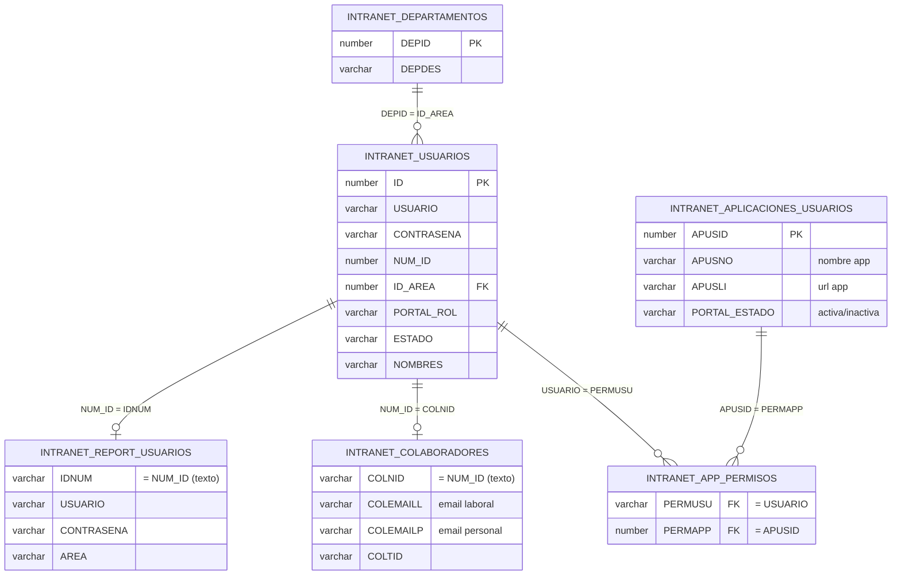

# Cómo se relacionan las tablas del Login

Todas las tablas viven en el esquema Oracle `BDLIGA` y se consultan desde
[`app/queries/user_queries.py`](app/queries/user_queries.py). El punto de
partida es siempre `INTRANET_USUARIOS`; el resto de tablas se van uniendo
(LEFT JOIN) a partir del usuario para completar sus datos.

## Diagrama

## Explicación tabla por tabla

### 1. `INTRANET_USUARIOS` (tabla central)
Es la tabla de login: guarda `USUARIO`, `CONTRASENA`, el número de
identificación (`NUM_ID`), el área (`ID_AREA`), el rol del portal
(`PORTAL_ROL`) y el estado (`ESTADO`). Todas las demás tablas se
"cuelgan" de aquí.

### 2. `INTRANET_DEPARTAMENTOS`
Se une por `ID_AREA = DEPID` para traducir el área del usuario a un
nombre legible (`DEPDES`). Relación: **muchos usuarios → un departamento**.

### 3. `INTRANET_COLABORADORES`
Se une convirtiendo `NUM_ID` a texto y comparándolo con `COLNID`. Aporta
los correos (`COLEMAILL` = laboral, `COLEMAILP` = personal) y el tipo de
colaborador (`COLTID`). Relación: **uno a uno (opcional)**, por eso es
`LEFT JOIN` — no todos los usuarios tienen colaborador asociado.

### 4. `INTRANET_REPORT_USUARIOS`
También se une por `NUM_ID = IDNUM` (como texto). Guarda credenciales y
área de un sistema de reportes aparte (`CONTRASENA_REPORT`,
`REPORT_USUARIO`). Igual que arriba, es opcional (`LEFT JOIN`).

### 5. `INTRANET_APP_PERMISOS`
Tabla puente: relaciona un `USUARIO` (`PERMUSU`) con una aplicación
(`PERMAPP`). Es lo que permite que **un usuario tenga varias apps** y
que **una app tenga varios usuarios** (muchos-a-muchos).

### 6. `INTRANET_APLICACIONES_USUARIOS`
Catálogo de aplicaciones del portal: `APUSID` (id), `APUSNO` (nombre),
`APUSLI` (URL) y `PORTAL_ESTADO` (si está activa o inactiva). Se llega a
ella desde `INTRANET_APP_PERMISOS.PERMAPP = APUSID`.

## Flujo típico (login)

1. El usuario envía `USUARIO` + `CONTRASENA` (`AUTH_USER_QUERY`).
2. Se busca en `INTRANET_USUARIOS` y se completan datos de
   `INTRANET_DEPARTAMENTOS`, `INTRANET_COLABORADORES` e
   `INTRANET_REPORT_USUARIOS` mediante `LEFT JOIN`.
3. Ya autenticado, `APPS_BY_USER_QUERY` busca en `INTRANET_APP_PERMISOS`
   qué aplicaciones (`INTRANET_APLICACIONES_USUARIOS`) tiene permitidas
   ese usuario, filtrando solo las que están `activa`.
