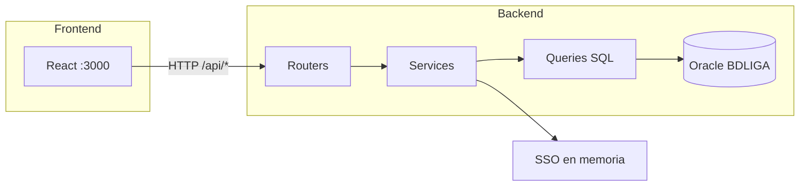
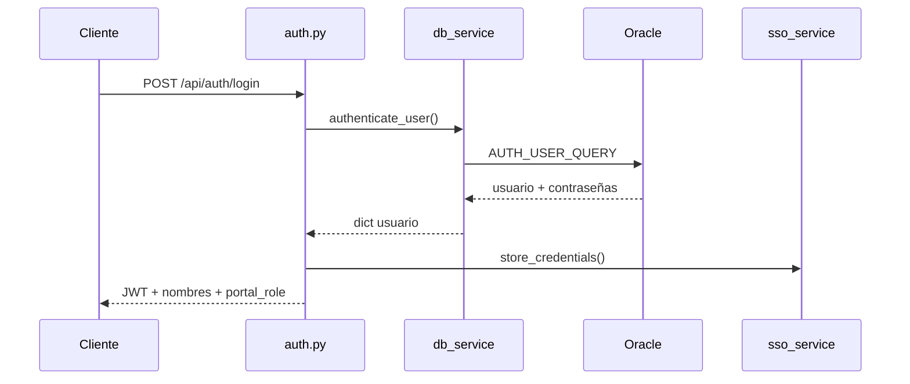
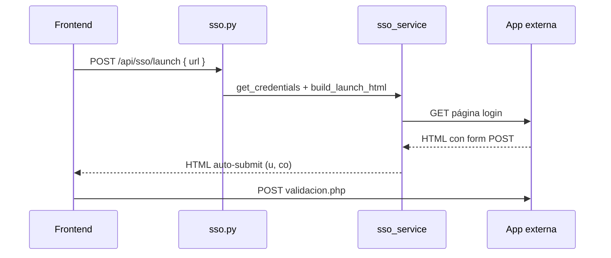

# Backend — Portal de Accesos (Fundación La Liga)

API REST construida con **FastAPI** y **Python 3**. Se conecta a Oracle **BDLIGA** para autenticar usuarios, listar aplicaciones permitidas, lanzar sesiones SSO hacia sistemas legacy (`apps.laliga.org.co`) y administrar usuarios, roles y permisos.

---

## ¿Qué hace este backend?

| Función            | Descripción                                                                                                            |
| ------------------- | ----------------------------------------------------------------------------------------------------------------------- |
| **Login**     | Valida credenciales contra`INTRANET_USUARIOS` e `INTRANET_REPORT_USUARIOS` y emite un JWT.                          |
| **Dashboard** | Devuelve las aplicaciones (`INTRANET_APP_PERMISOS` + `INTRANET_APLICACIONES_USUARIOS`) del usuario autenticado.     |
| **SSO**       | Genera HTML con auto-submit POST hacia`validacion.php` de cada app externa, usando credenciales guardadas en memoria. |
| **Admin**     | CRUD de usuarios, asignación de roles (`PORTAL_ROL`), departamentos y permisos por aplicación.                      |

Puerto por defecto: **5000**
Prefijo de API: **`/api`**

---

## Arquitectura general



**Capas:**

1. **`routers/`** — Endpoints HTTP (rutas, códigos de error, validación de entrada).
2. **`services/`** — Lógica de negocio (auth, admin, SSO, acceso a datos).
3. **`queries/`** — SQL centralizado contra tablas Oracle.
4. **`schemas/`** — Modelos Pydantic (request/response).
5. **`core/`** — JWT y utilidades de seguridad.
6. **`dependencies.py`** — Inyección de usuario autenticado y guard de admin.

---

## Estructura de carpetas y archivos

```
Backend/
├── main.py                 # Punto de entrada para uvicorn
├── run.ps1                 # Script Windows: libera puerto 5000 e inicia el servidor
├── requirements.txt        # Dependencias Python
├── .env                    # Variables de entorno (no subir a git)
├── .env.example            # Plantilla de configuración
│
├── app/
│   ├── main.py             # App FastAPI, CORS, registro de routers, /health
│   ├── config.py           # Settings desde .env (Oracle, JWT, prefijo API)
│   ├── database.py         # Pool de conexiones Oracle (oracledb)
│   ├── dependencies.py     # get_current_user, require_admin_access
│   │
│   ├── core/
│   │   ├── __init__.py
│   │   └── security.py     # create_access_token, decode_access_token, bcrypt
│   │
│   ├── routers/
│   │   ├── __init__.py
│   │   ├── auth.py         # POST /login, GET /me, POST /logout
│   │   ├── pages.py        # GET /pages (apps del usuario)
│   │   ├── sso.py          # GET/POST /sso/launch
│   │   └── admin.py        # CRUD admin: users, departments, applications
│   │
│   ├── schemas/
│   │   ├── __init__.py
│   │   ├── auth.py         # LoginRequest, AuthResponse, UserInfo
│   │   ├── admin.py        # ManagedUser, UserCreateRequest, UserUpdateRequest, etc.
│   │   └── pages.py        # PageLink
│   │
│   ├── queries/
│   │   └── user_queries.py # SQL reutilizable (auth, listados, permisos, apps)
│   │
│   └── services/
│       ├── __init__.py
│       ├── users_service.py      # Fachada auth → db_service (solo Oracle)
│       ├── db_service.py         # authenticate, get_user, apps, permisos
│       ├── links_service.py      # get_pages_for_user → db_service
│       ├── sso_service.py        # Credenciales en RAM + HTML auto-login
│       ├── admin_service.py      # CRUD usuarios, permisos, departamentos, apps
│       └── user_report_service.py # Listados completos / summary para reportes
│
└── scripts/
    ├── setup_admin.py      # Migración: columna PORTAL_ROL + usuario admin
    └── setup_app_estado.py # Migración: columna PORTAL_ESTADO en aplicaciones
```

---

## Descripción detallada por archivo

### Raíz del backend

| Archivo                        | Propósito                                                                                              |
| ------------------------------ | ------------------------------------------------------------------------------------------------------- |
| **`main.py`**          | Reexporta`app` desde `app.main` para que uvicorn ejecute `uvicorn main:app`.                      |
| **`run.ps1`**          | Detiene procesos en el puerto 5000 y arranca`uvicorn main:app --reload --host 127.0.0.1 --port 5000`. |
| **`requirements.txt`** | FastAPI, uvicorn, python-jose (JWT), passlib (bcrypt), pydantic-settings, oracledb.                     |
| **`.env`**             | Credenciales Oracle (`SCSE_DB_*`), `SECRET_KEY`, duración del token.                               |
| **`.env.example`**     | Ejemplo de variables; copiar a`.env` y completar valores reales.                                      |

### `app/main.py`

- Crea la instancia **FastAPI** con lifespan (inicializa/cierra pool Oracle).
- Configura **CORS** para `http://localhost:3000` (frontend Vite).
- Monta routers bajo `/api`: `auth`, `pages`, `sso`, `admin`.
- Expone **`GET /health`** con estado, `db_enabled` y versión.

### `app/config.py`

Lee configuración con **pydantic-settings**:

| Variable                                                                                     | Uso                                     |
| -------------------------------------------------------------------------------------------- | --------------------------------------- |
| `SECRET_KEY`                                                                               | Firma del JWT                           |
| `ACCESS_TOKEN_EXPIRE_MINUTES`                                                              | Expiración del token (default 480 min) |
| `SCSE_DB_USER`, `SCSE_DB_PASSWD`, `SCSE_DB_IP`, `SCSE_DB_PORT`, `SCSE_DB_DATABASE` | Conexión Oracle                        |

La propiedad calculada **`db_enabled`** es `True` cuando hay user, IP y database configurados.

> Nota: existen rutas legacy en `config.py` hacia `data/users.json`; el flujo actual **solo usa Oracle**.

### `app/database.py`

- **`init_db()`** — Crea pool `oracledb` (min 1, max 10 conexiones).
- **`get_connection()`** — Context manager para adquirir conexión del pool.
- **`close_db()`** — Cierra el pool al apagar el servidor.

### `app/dependencies.py`

| Función                           | Comportamiento                                                                                       |
| ---------------------------------- | ---------------------------------------------------------------------------------------------------- |
| **`get_current_user`**     | Lee header`Authorization: Bearer <token>`, decodifica JWT, carga usuario de BD, rechaza inactivos. |
| **`require_admin_access`** | Exige`portal_role` en `admin` o `area_admin`.                                                  |

### `app/core/security.py`

- Genera y valida tokens **JWT** (HS256).
- Funciones `hash_password` / `verify_password` con bcrypt (reservadas para usos futuros; las contraseñas Oracle se comparan en texto en `db_service`).

---

### Routers (`app/routers/`)

#### `auth.py` — prefijo `/api/auth`

| Método | Ruta        | Descripción                                                                     |
| ------- | ----------- | -------------------------------------------------------------------------------- |
| POST    | `/login`  | Autentica, guarda credenciales SSO en memoria, devuelve JWT + datos del usuario. |
| GET     | `/me`     | Perfil del usuario autenticado.                                                  |
| POST    | `/logout` | Borra credenciales SSO de memoria.                                               |

#### `pages.py` — prefijo `/api/pages`

| Método | Ruta | Descripción                                               |
| ------- | ---- | ---------------------------------------------------------- |
| GET     | ``   | Lista`PageLink[]` de apps activas permitidas al usuario. |

#### `sso.py` — prefijo `/api/sso`

| Método | Ruta                | Descripción                                                         |
| ------- | ------------------- | -------------------------------------------------------------------- |
| POST    | `/launch`         | Body`{ "url": "..." }` → HTML que hace POST a `validacion.php`. |
| GET     | `/launch?url=...` | Misma lógica vía query string.                                     |

Requiere sesión activa y credenciales aún en memoria (TTL ~8 h).

#### `admin.py` — prefijo `/api/admin`

Requiere rol **admin** o **area_admin**.

| Método | Ruta                             | Descripción                                                 |
| ------- | -------------------------------- | ------------------------------------------------------------ |
| GET     | `/departments`                 | Lista departamentos (`INTRANET_DEPARTAMENTOS`).            |
| GET     | `/applications?estado=`        | Catálogo de apps; filtro opcional`activa` / `inactiva`. |
| GET     | `/users`                       | Lista usuarios para el panel (`?id_area=&q=`).             |
| GET     | `/users/{username}`            | Detalle de un usuario.                                       |
| POST    | `/users`                       | Crear usuario.                                               |
| PUT     | `/users/{username}`            | Actualizar usuario.                                          |
| POST    | `/users/{username}/deactivate` | Desactivar usuario.                                          |
| GET     | `/users/summary`               | Resumen con conteo de apps (reportes).                       |
| GET     | `/users/full`                  | Usuarios con apps anidadas (reportes).                       |
| GET     | `/users/full/{username}`       | Detalle completo de un usuario.                              |

---

### Schemas (`app/schemas/`)

| Archivo                | Modelos principales                                                                                    |
| ---------------------- | ------------------------------------------------------------------------------------------------------ |
| **`auth.py`**  | `LoginRequest`, `AuthResponse`, `UserInfo`                                                       |
| **`admin.py`** | `ManagedUser`, `UserCreateRequest`, `UserUpdateRequest`, `DepartmentItem`, `ApplicationItem` |
| **`pages.py`** | `PageLink` (id, name, url, ip, icon, description)                                                    |

Los schemas validan entrada/salida y documentan la API en Swagger (`/docs`).

---

### Queries (`app/queries/user_queries.py`)

Centraliza el SQL Oracle. Piezas clave:

| Constante                                | Uso                                                             |
| ---------------------------------------- | --------------------------------------------------------------- |
| **`USER_DATA_SUBQUERY`**         | JOIN base: usuarios + reportes + colaboradores + departamentos. |
| **`AUTH_USER_QUERY`**            | Login: contraseñas intranet y reportes.                        |
| **`USER_BY_USERNAME_QUERY`**     | Perfil por username.                                            |
| **`APPS_BY_USER_QUERY`**         | Apps activas (`PORTAL_ESTADO = 'activa'`) del usuario.        |
| **`LIST_USERS_SUMMARY_QUERY`**   | Admin/reportes: una fila por usuario + total apps.              |
| **`LIST_USERS_WITH_APPS_QUERY`** | Detalle usuario-app (puede repetir filas).                      |
| **`LIST_DEPARTMENTS_QUERY`**     | Catálogo departamentos.                                        |
| **`LIST_APPLICATIONS_QUERY`**    | Catálogo aplicaciones con estado portal.                       |
| **`USER_PERMISSIONS_QUERY`**     | IDs de apps asignadas a un usuario.                             |

---

### Services (`app/services/`)

#### `users_service.py`

Fachada delgada: delega en `db_service` si Oracle está habilitado; lanza error si no hay BD.

#### `db_service.py`

Núcleo de acceso a datos para auth y dashboard:

- **`authenticate_user`** — Acepta contraseña de intranet o de reportes.
- **`get_user_by_username`** — Datos de perfil y rol portal.
- **`get_user_applications`** — Convierte filas Oracle en `PageLink`.
- **`fetch_user_permission_ids`** — IDs de permisos para admin.
- **`_sso_username`** — Prioriza `REPORT_USUARIO` o `IDNUM` para SSO externo.

#### `links_service.py`

Una función: **`get_pages_for_user(username, role)`** → apps del usuario.

#### `sso_service.py`

Módulo crítico para abrir apps legacy:

1. **`store_credentials`** — Guarda password y username de app en dict en RAM (por usuario portal).
2. **`build_launch_html`** — Descarga la página destino, detecta formulario POST, resuelve `action` con `urljoin`, envía campos `u` y `co`.
3. **`_page_base_for_join`** — Corrige URLs sin barra final para que `modulos/validacion.php` resuelva bien.

#### `admin_service.py`

Lógica del panel de administración:

- **`list_managed_users`** — Lista con filtros; emails vía subconsulta (evita duplicados); permisos en una sola query.
- **`get_managed_user`** — Consulta individual (no recarga toda la lista).
- **`create_managed_user` / `update_managed_user` / `deactivate_managed_user`** — Sincroniza:
  - `INTRANET_USUARIOS`
  - `INTRANET_COLABORADORES` (emails)
  - `INTRANET_REPORT_USUARIOS` (SSO; contraseña máx. 20 caracteres)
  - `INTRANET_APP_PERMISOS`
- **`_can_manage_target`** — `area_admin` solo gestiona su departamento y no puede crear admins.

#### `user_report_service.py`

Endpoints de reporte (`/users/full`, `/users/summary`): agrupa filas SQL en estructuras JSON anidadas.

---

### Scripts (`scripts/`)

| Script                            | Qué hace                                                                                         |
| --------------------------------- | ------------------------------------------------------------------------------------------------- |
| **`setup_admin.py`**      | Crea columna`PORTAL_ROL` en `INTRANET_USUARIOS` y usuario `admin` / `12345` si no existe. |
| **`setup_app_estado.py`** | Crea columna`PORTAL_ESTADO` (`activa`/`inactiva`) en `INTRANET_APLICACIONES_USUARIOS`.    |

Ejecución (desde carpeta `Backend`):

```powershell
$env:PYTHONPATH="."
python scripts/setup_admin.py
python scripts/setup_app_estado.py
```

---

## Tablas Oracle utilizadas

| Tabla                              | Rol en el portal                                                               |
| ---------------------------------- | ------------------------------------------------------------------------------ |
| `INTRANET_USUARIOS`              | Usuario, contraseña intranet, cédula, área, estado,**`PORTAL_ROL`** |
| `INTRANET_REPORT_USUARIOS`       | Credenciales para apps/reportes (SSO)                                          |
| `INTRANET_COLABORADORES`         | Emails personal/laboral por cédula                                            |
| `INTRANET_DEPARTAMENTOS`         | Catálogo de áreas (`ID_AREA` → `DEPID`)                                 |
| `INTRANET_APLICACIONES_USUARIOS` | Catálogo de URLs (`APUSLI`, `APUSNO`, **`PORTAL_ESTADO`**)        |
| `INTRANET_APP_PERMISOS`          | Qué apps puede ver cada usuario (`PERMUSU`, `PERMAPP`)                    |

---

## Roles del portal (`PORTAL_ROL`)

| Rol                      | Permisos                                                               |
| ------------------------ | ---------------------------------------------------------------------- |
| **`admin`**      | Acceso total al panel admin; ve todos los departamentos.               |
| **`area_admin`** | Administra solo usuarios de su`ID_AREA`; no puede asignar rol admin. |
| **`usuario`**    | Solo dashboard de aplicaciones (sin panel admin).                      |

---

## Flujo de autenticación



---

## Flujo SSO (abrir una aplicación)



---

## Cómo ejecutar en desarrollo

### 1. Entorno virtual e dependencias

```powershell
cd Backend
python -m venv .venv
.\.venv\Scripts\Activate.ps1
pip install -r requirements.txt
```

### 2. Configurar `.env`

Copiar `.env.example` → `.env` y completar:

```env
SECRET_KEY=clave-segura-en-produccion
SCSE_DB_USER=tu_usuario
SCSE_DB_PASSWD=tu_password
SCSE_DB_IP=tu_host
SCSE_DB_PORT=1521
SCSE_DB_DATABASE=tu_servicio
```

### 3. Migraciones (una vez)

```powershell
$env:PYTHONPATH="."
python scripts/setup_admin.py
python scripts/setup_app_estado.py
```

### 4. Arrancar servidor

```powershell
.\run.ps1
```

Verificar: [http://localhost:5000/health](http://localhost:5000/health)
Documentación interactiva: [http://localhost:5000/docs](http://localhost:5000/docs)

---

## Endpoints de utilidad

| Ruta            | Respuesta                                                                 |
| --------------- | ------------------------------------------------------------------------- |
| `GET /health` | `{ "status": "ok", "db_enabled": true, "version": "...", "sso": true }` |
| `GET /docs`   | Swagger UI                                                                |
| `GET /redoc`  | ReDoc                                                                     |

---

## Notas importantes para desarrolladores

1. **Credenciales SSO en memoria** — Si reinicias el backend, el usuario debe volver a hacer login para abrir apps externas.
2. **Contraseña reportes** — Máximo **20 caracteres** (`INTRANET_REPORT_USUARIOS.CONTRASENA`); la intranet admite hasta 40.
3. **CORS** — Solo localhost:3000; ajustar en producción.
4. **Cliente Oracle** — `oracledb.init_oracle_client()` intenta modo thick; si falla, usa thin mode.
5. **Duplicados colaboradores** — Las consultas de admin usan subconsultas en lugar de `JOIN` directo a `INTRANET_COLABORADORES` para evitar filas repetidas por cédula.

---

## Relación con el frontend

El frontend (Vite, puerto **3000**) hace proxy de `/api` → `http://localhost:5000`. Todas las peticiones autenticadas envían:

```
Authorization: Bearer <token>
```

Ver documentación complementaria en [`../frontend/README.md`](../frontend/README.md).
