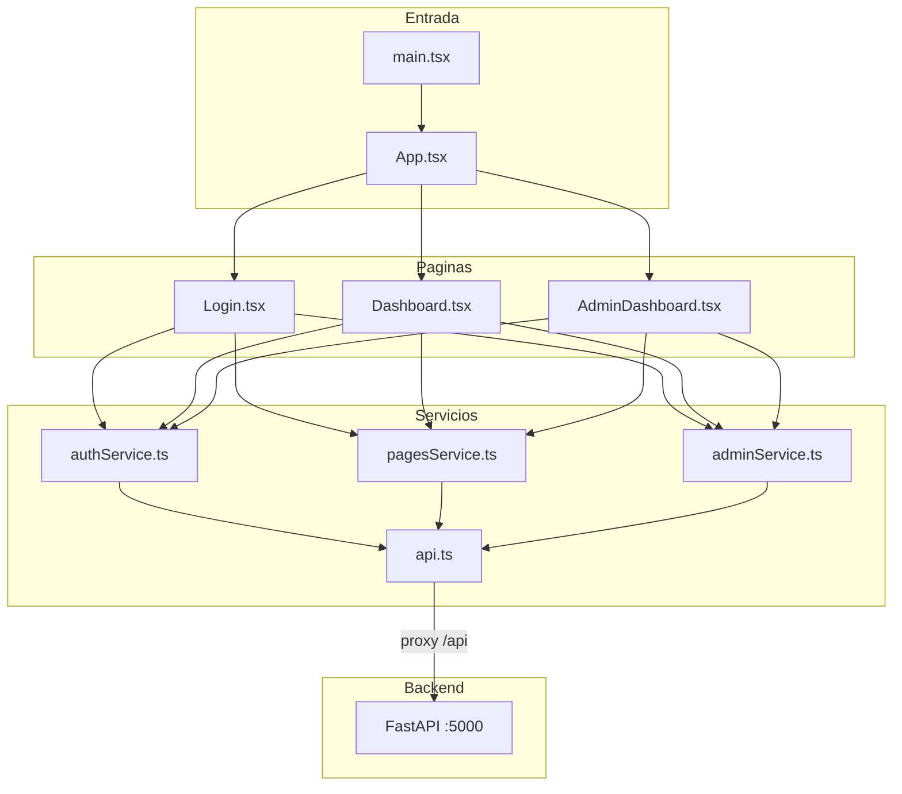
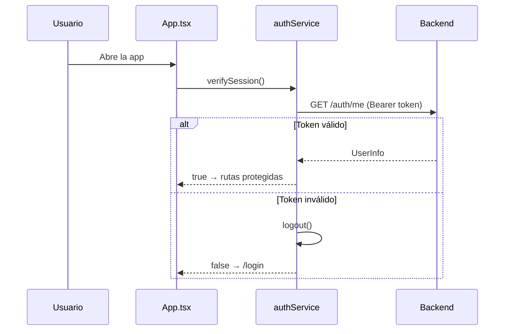
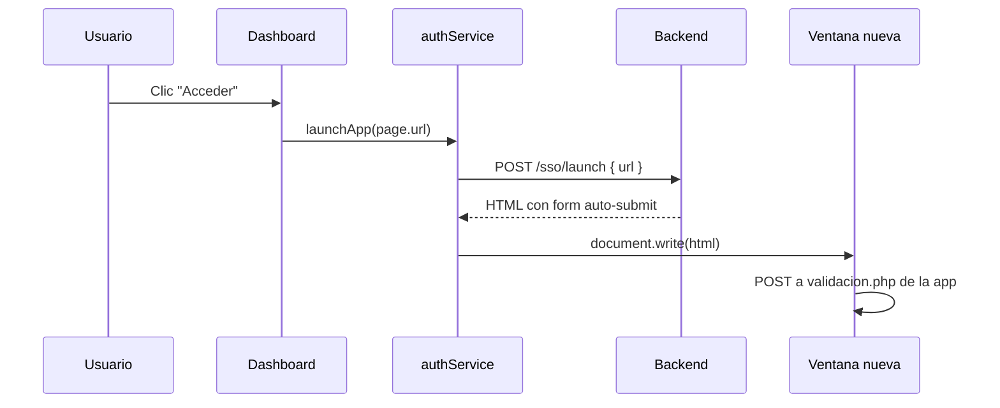

# Frontend — Portal de Accesos (Fundación La Liga)

Aplicación web **React 19 + TypeScript + Vite** que permite iniciar sesión, ver las aplicaciones autorizadas, abrirlas vía SSO y (para administradores) gestionar usuarios, roles y permisos.

Puerto de desarrollo: **3000**
Proxy API: **`/api` → http://localhost:5000**

---

## ¿Qué hace este frontend?

| Pantalla            | Ruta           | Quién la ve                                                    |
| ------------------- | -------------- | --------------------------------------------------------------- |
| **Login**     | `/login`     | Todos (no autenticados)                                         |
| **Dashboard** | `/dashboard` | Usuarios con rol`usuario` (y admins que naveguen manualmente) |
| **Admin**     | `/admin`     | Roles`admin` y `area_admin`                                 |

Tras login exitoso:

- `admin` / `area_admin` → redirige a **`/admin`**
- `usuario` → redirige a **`/dashboard`**

---

## Stack tecnológico

| Tecnología              | Uso                              |
| ------------------------ | -------------------------------- |
| **React 19**       | UI por componentes               |
| **TypeScript**     | Tipado estático                 |
| **Vite 8**         | Bundler y servidor de desarrollo |
| **React Router 6** | Rutas y navegación              |
| **Axios**          | Cliente HTTP hacia`/api`       |

---

## Arquitectura general



**Principio de organización:**

- **`pages/`** — Pantallas completas (estado local, efectos, UI).
- **`services/`** — Llamadas HTTP; sin lógica de presentación.
- **`types/`** — Interfaces TypeScript compartidas.
- **`assets/`** — Estilos globales.

---

## Estructura de carpetas y archivos

```
frontend/
├── index.html              # HTML base; monta #root y carga main.tsx
├── package.json            # Dependencias y scripts npm
├── package-lock.json       # Lockfile de dependencias
├── vite.config.ts          # Vite: alias @, puerto 3000, proxy /api
├── tsconfig.json           # Config TypeScript principal
├── tsconfig.app.json       # TS para código de aplicación
├── tsconfig.node.json      # TS para archivos Node (vite.config)
│
├── public/                 # Archivos estáticos servidos tal cual
│   ├── favicon.svg
│   ├── icons.svg
│   └── LogoLigaLight.png   # Logo (debe existir aquí para /LogoLigaLight.png)
│
└── src/
    ├── main.tsx            # Punto de entrada React
    ├── App.tsx             # Router, guards de sesión, rutas
    ├── vite-env.d.ts       # Tipos de Vite (import.meta, etc.)
    │
    ├── assets/
    │   └── styles.css      # Estilos globales del portal y admin
    │
    ├── pages/
    │   ├── Login.tsx       # Formulario de inicio de sesión
    │   ├── Dashboard.tsx   # Grid de aplicaciones del usuario
    │   └── AdminDashboard.tsx  # Panel CRUD usuarios y permisos
    │
    ├── services/
    │   ├── api.ts          # Instancia Axios + interceptores JWT
    │   ├── authService.ts  # Login, logout, sesión, SSO launch
    │   ├── pagesService.ts # GET /pages
    │   └── adminService.ts # Endpoints /admin/*
    │
    └── types/
        └── index.ts        # Interfaces TypeScript de la API
```

> **`node_modules/`** — Dependencias instaladas con `npm install`; no editar manualmente.

---

## Descripción detallada por archivo

### Configuración del proyecto

#### `index.html`

Plantilla HTML mínima:

- Título: *Fundación La Liga — Portal de Accesos*
- Favicon y logo desde `/LogoLigaLight.png` (carpeta `public/`)
- `<div id="root">` donde React monta la app
- Script module: `/src/main.tsx`

#### `package.json`

| Script      | Comando                  | Descripción                         |
| ----------- | ------------------------ | ------------------------------------ |
| `dev`     | `vite`                 | Servidor desarrollo en :3000         |
| `build`   | `tsc -b && vite build` | Compila TypeScript y genera`dist/` |
| `preview` | `vite preview`         | Previsualiza build de producción    |
| `lint`    | `eslint .`             | Linter                               |

Dependencias principales: `react`, `react-dom`, `react-router-dom`, `axios`.

#### `vite.config.ts`

```typescript
server: {
  port: 3000,
  proxy: {
    '/api': { target: 'http://localhost:5000', changeOrigin: true }
  }
}
```

- Alias **`@`** → `./src` (ej. `import X from '@/services/api'`).
- En desarrollo, las peticiones a `/api/...` las atiende el backend en el puerto 5000.

#### `tsconfig.json` / `tsconfig.app.json` / `tsconfig.node.json`

- Modo **strict** activado.
- JSX: `react-jsx` (sin importar React en cada archivo).
- `baseUrl: "src"` para imports relativos cortos.

---

### Punto de entrada

#### `src/main.tsx`

- Crea root de React en `#root`.
- Importa **`styles.css`** global.
- Envuelve `<App />` en `<React.StrictMode>`.

#### `src/App.tsx`

Componente raíz con **React Router** y control de sesión:

1. Al montar, llama **`verifySession()`** (valida JWT contra `GET /api/auth/me`).
2. Mientras verifica, muestra spinner *"Cargando..."*.
3. Define rutas protegidas:

| Ruta           | Si autenticado                        | Si no autenticado    |
| -------------- | ------------------------------------- | -------------------- |
| `/login`     | Redirige a`/dashboard`              | Muestra`Login`     |
| `/dashboard` | Muestra`Dashboard`                  | Redirige a`/login` |
| `/admin`     | Muestra`AdminDashboard`             | Redirige a`/login` |
| `*`          | Redirige a`/dashboard` o `/login` | —                   |

Estado `isAuthenticated` se actualiza vía callbacks `onLoginSuccess` / `onLogout`.

#### `src/vite-env.d.ts`

Referencias de tipos de Vite (`/// <reference types="vite/client" />`).

---

### Páginas (`src/pages/`)

#### `Login.tsx`

Pantalla de acceso:

- Formulario: `username`, `password`.
- Al montar ejecuta **`logout()`** para limpiar tokens previos (evita sesiones inconsistentes).
- **`handleSubmit`**:
  1. `POST /api/auth/login`
  2. Guarda en `localStorage`: `token`, `role`, `portal_role`, `username`, `nombres`, `id_area`, `area_name`
  3. Redirige a `/admin` si es admin, si no a `/dashboard`
- Muestra errores del backend (`detail` de FastAPI).

#### `Dashboard.tsx`

Portal principal para usuarios:

- Carga apps con **`getPages()`** → `GET /api/pages`.
- Navbar: logo, nombre, rol, botón *Administración* (solo si `isAdminRole()`), *Salir*.
- Grid de tarjetas (`page-card`) con nombre, descripción, host.
- Botón **Acceder** → **`launchApp(url)`**:
  - Pide HTML a `POST /api/sso/launch`
  - Abre ventana nueva y escribe el HTML (auto-login en app externa).
- Estados: loading, error, lista vacía, *"Abriendo..."* por tarjeta.

#### `AdminDashboard.tsx`

Panel de administración (~570 líneas). Funcionalidades:

| Sección                   | Descripción                                                                |
| -------------------------- | --------------------------------------------------------------------------- |
| **Listado**          | Tabla de usuarios con búsqueda (debounce 350 ms) y filtro por departamento |
| **Filtros**          | `q` (nombre/usuario), `id_area`; `area_admin` ve solo su área        |
| **Modal formulario** | Crear / editar usuario en secciones (datos, rol, permisos)                  |
| **Permisos**         | Checkboxes de apps con filtro por nombre y estado (`activa`/`inactiva`) |
| **Acciones**         | Guardar, desactivar, volver al dashboard                                    |

Datos cargados en paralelo al inicio:

- `getManagedUsers(filters)`
- `getDepartments()`
- `getApplications()`

Roles en UI:

- **`admin`**: elige departamento y rol de cualquier usuario.
- **`area_admin`**: departamento bloqueado al suyo; solo crea usuarios `usuario`.

Clase CSS **`admin-input`** en inputs del modal (evita fondo negro del tema oscuro del login).

Key de filas: `user.id_usuario ?? \`${user.username}-${user.num_id}\`` (evita keys duplicadas).

---

### Servicios (`src/services/`)

#### `api.ts` — Cliente HTTP base

```typescript
const api = axios.create({ baseURL: '/api' });
```

**Interceptor de request:** añade `Authorization: Bearer <token>` si existe en `localStorage`.

**Interceptor de response:** en **401** (excepto `/auth/login`):

- Limpia sesión
- Redirige a `/login`

Export default: instancia única usada por todos los servicios.

#### `authService.ts`

| Función              | Endpoint             | Descripción                          |
| --------------------- | -------------------- | ------------------------------------- |
| `login(form)`       | POST`/auth/login`  | Devuelve`AuthResponse`              |
| `getMe()`           | GET`/auth/me`      | Perfil actual                         |
| `logout()`          | POST`/auth/logout` | Limpia backend + localStorage         |
| `isAuthenticated()` | —                   | Comprueba token JWT en localStorage   |
| `verifySession()`   | GET`/auth/me`      | Valida token al cargar la app         |
| `launchApp(url)`    | POST`/sso/launch`  | Abre app en nueva ventana             |
| `isAdminRole()`     | —                   | `portal_role` es admin o area_admin |
| `getPortalRole()`   | —                   | Lee rol del localStorage              |

#### `pagesService.ts`

| Función       | Endpoint      |
| -------------- | ------------- |
| `getPages()` | GET`/pages` |

#### `adminService.ts`

| Función                                 | Endpoint                                   |
| ---------------------------------------- | ------------------------------------------ |
| `getDepartments()`                     | GET`/admin/departments`                  |
| `getApplications(estado?)`             | GET`/admin/applications`                 |
| `getManagedUsers(filters?)`            | GET`/admin/users`                        |
| `createManagedUser(payload)`           | POST`/admin/users`                       |
| `updateManagedUser(username, payload)` | PUT`/admin/users/{username}`             |
| `deactivateManagedUser(username)`      | POST`/admin/users/{username}/deactivate` |

`UserListFilters`: `{ id_area?: number; q?: string }`.

---

### Tipos (`src/types/index.ts`)

Interfaces alineadas con los schemas del backend:

| Interface                                     | Uso                                        |
| --------------------------------------------- | ------------------------------------------ |
| `LoginForm`                                 | Usuario + contraseña                      |
| `AuthResponse`                              | Respuesta de login (token, roles, área)   |
| `UserInfo`                                  | Perfil de`/auth/me`                      |
| `PageLink`                                  | App en dashboard (id, name, url, ip, icon) |
| `Department`                                | Departamento admin                         |
| `Application`                               | App del catálogo admin                    |
| `ManagedUser`                               | Usuario en panel admin                     |
| `UserCreatePayload` / `UserUpdatePayload` | Formularios admin                          |

Tipos legacy (`User`, `Page`) permanecen por compatibilidad pero el flujo actual usa `PageLink` y `AuthResponse`.

---

### Estilos (`src/assets/styles.css`)

Hoja única de estilos globales. Secciones principales:

| Sección             | Clases relevantes                                                                          |
| -------------------- | ------------------------------------------------------------------------------------------ |
| **Login**      | `.login-container`, `.login-card`, `.form-group`, `.btn-primary`                   |
| **Dashboard**  | `.dashboard-layout`, `.navbar`, `.pages-grid`, `.page-card`, `.btn-access`       |
| **Admin**      | `.admin-layout`, `.admin-table`, `.admin-modal`, `.admin-input`, `.row-inactive` |
| **Utilidades** | `.spinner`, `.error-msg`, `.loading-container`, `.btn-secondary`, `.btn-logout`  |

Tema visual: fondo oscuro en login; dashboard y admin con navbar clara y tarjetas estructuradas.

---

### Carpeta `public/`

Archivos accesibles en la raíz del sitio:

| Archivo               | Uso                             |
| --------------------- | ------------------------------- |
| `LogoLigaLight.png` | Logo en login, navbar y favicon |
| `favicon.svg`       | Icono alternativo               |
| `icons.svg`         | Sprite de iconos (si se usa)    |

> Si el logo no aparece, colocar `LogoLigaLight.png` en `frontend/public/`.

---

## Flujo de sesión en el navegador



**Datos en `localStorage`:**

| Clave                      | Contenido                        |
| -------------------------- | -------------------------------- |
| `token`                  | JWT                              |
| `role` / `portal_role` | Rol efectivo                     |
| `username`               | Login                            |
| `nombres`                | Nombre para mostrar              |
| `id_area`                | ID departamento (admin de área) |
| `area_name`              | Nombre del departamento          |

---

## Flujo: abrir una aplicación (SSO)



---

## Rutas y navegación

```
/login          → Login (público)
/dashboard      → Apps del usuario (requiere token)
/admin          → Panel admin (requiere token + rol admin)
/*              → Redirige según autenticación
```

**Guards:** implementados en `App.tsx` con `Navigate` de React Router, no con componentes `ProtectedRoute` separados.

---

## Cómo ejecutar en desarrollo

### 1. Backend en marcha

El frontend depende del API en el puerto 5000. Desde la carpeta `Backend`:

```powershell
.\run.ps1
```

### 2. Instalar dependencias (primera vez)

```powershell
cd frontend
npm install
```

### 3. Servidor de desarrollo

```powershell
npm run dev
```

Abrir: [http://localhost:3000](http://localhost:3000)

### 4. Build de producción

```powershell
npm run build
npm run preview
```

El output queda en **`dist/`**. En producción hay que servir `dist/` y configurar el proxy o la URL base del API según el despliegue.

---

## Credenciales de prueba (admin)

Tras ejecutar `Backend/scripts/setup_admin.py`:

| Campo       | Valor     |
| ----------- | --------- |
| Usuario     | `admin` |
| Contraseña | `12345` |

Redirige automáticamente a `/admin`.

---

## Errores frecuentes y solución

| Síntoma                     | Causa probable                            | Qué hacer                                     |
| ---------------------------- | ----------------------------------------- | ---------------------------------------------- |
| 401 en todas las peticiones  | Backend caído o token expirado           | Reiniciar backend; volver a login              |
| `/api` devuelve 404        | Backend no corre en :5000                 | Ejecutar`Backend/run.ps1`                    |
| Logo roto                    | Falta`LogoLigaLight.png` en `public/` | Copiar el asset al folder public               |
| Popup bloqueado al abrir app | Navegador bloquea ventanas                | Permitir popups para localhost                 |
| 401 en logout al abrir login | Token ya expirado al montar Login         | Comportamiento esperado;`logout()` lo ignora |
| Panel admin lento            | Muchos usuarios + ~790 apps               | Normal en carga inicial; filtros reducen lista |

---

## Convenciones de código

1. **Servicios** — Una función async por endpoint; tipado de retorno explícito.
2. **Páginas** — Estado local con `useState`; efectos con `useEffect` / `useCallback`.
3. **Errores API** — Se lee `error.response?.data?.detail` (formato FastAPI).
4. **Imports** — Relativos desde `pages/` hacia `services/` y `types/`.
5. **Sin estado global** — No hay Redux/Context; sesión vive en `localStorage` + estado en `App.tsx`.

---

## Relación con el backend

| Frontend                  | Backend                  |
| ------------------------- | ------------------------ |
| `authService.login`     | `POST /api/auth/login` |
| `authService.getMe`     | `GET /api/auth/me`     |
| `pagesService.getPages` | `GET /api/pages`       |
| `authService.launchApp` | `POST /api/sso/launch` |
| `adminService.*`        | `/api/admin/*`         |

Documentación del API y tablas Oracle: [`../Backend/README.md`](../Backend/README.md).
